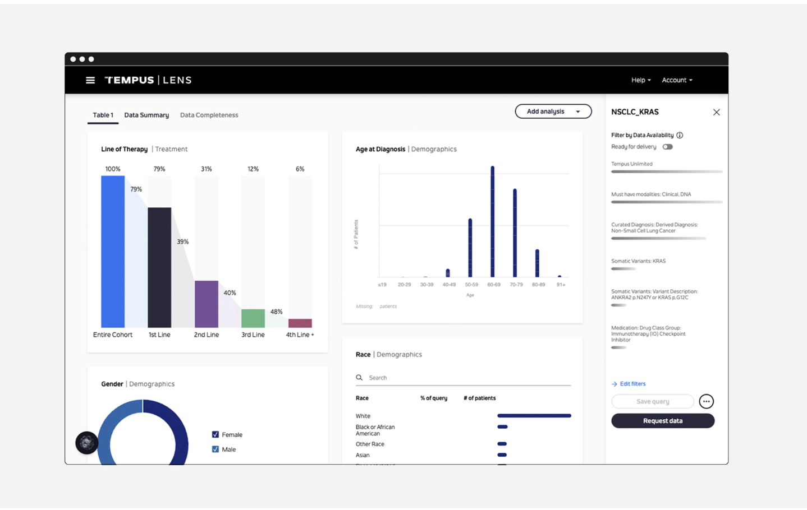

# Evaluating Tempus AI

## Opportunity

What problems does this tool solve?

- Integrated care: Tempus AI addresses the challenge of integrating multi-modal data to streamline patient care. They provide a comprehensive view of a patient’s condition, which helps in developing personalised treatment plans.
- Advanced data analysis: Tempus AI tackles the complexity of analysing large-scale, multi-dimensional data from clinical trials and research studies. It helps in uncovering insights and trends that are crucial for advancing cancer research.

How can it improve current processes?

- Personalised treatment plans: Tempus One leverages integrated data to tailor treatment strategies based on individual patient profiles, improving the precision of care.
- Efficient data handling: Tempus LENS automates the process of data analysis, allowing you to gain quicker insights and accelerate the pace of research and clinical decision-making.

## Risk

What are the potential downsides?

- Data privacy and security: Handling extensive and sensitive patient data (including genomic information) raises concerns about data privacy and security. There’s a risk of potential data breaches or unauthorised access.
- Compliance challenges: Adhering to regulations such as HIPAA and other data protection laws is critical. Any non-compliance could result in legal consequences and damage to reputation.

## Tangible Benefit

- Potential cost savings: By integrating and automating data analysis, Tempus solutions can reduce costs associated with manual data handling and processing. Enhanced treatment planning can also minimise the need for redundant tests and procedures.
- Time efficiency: Tempus One and LENS streamline data integration and analysis, leading to faster generation of actionable insights and personalised treatment plans. This efficiency accelerates both clinical and research workflows.
- Productivity: Tempus tools enhance productivity by reducing the manual effort involved in data analysis and integration. They allow oncologists and researchers to focus on critical aspects of patient care and research, improving overall efficiency.

## Evaluation

Does the benefit outweigh the risk?

- Tempus AI offers significant benefits, including integrated care solutions, advanced data analysis, and improved efficiency in oncology. These advantages are substantial, especially for personalised medicine and research. However, the risks related to data privacy and regulatory compliance must be managed effectively. If Tempus can ensure robust security measures and compliance, the benefits likely outweigh the risks.
  Would you recommend adoption?
- Given the considerable improvements in personalised treatment and research efficiency, Tempus AI solutions are recommended for adoption. They provide valuable tools for integrating and analysing complex data, which can really enhance oncology care and research capabilities. But you should proceed with careful attention to risk management and compliance.
